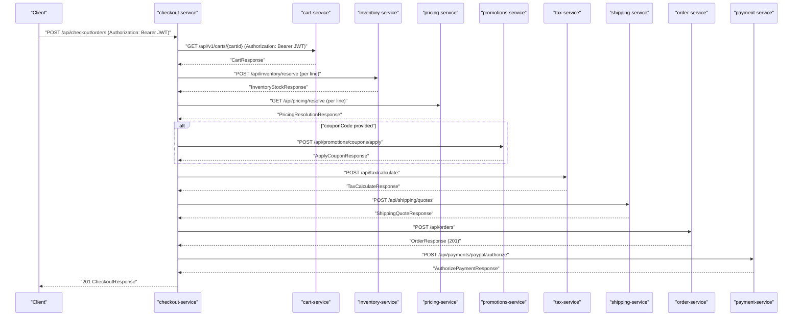
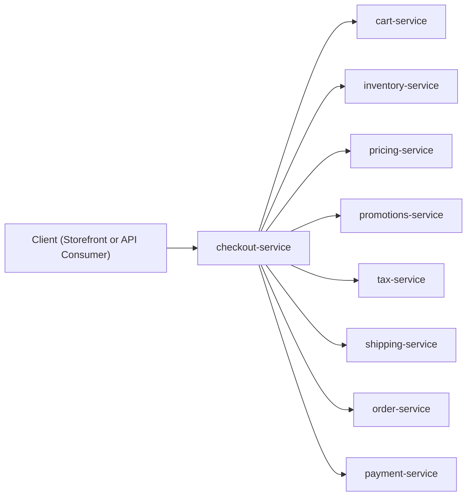

# shopizer-modern-java21 Architecture

## Overview
`shopizer-modern-java21` is a multi-module Maven repository containing a set of Spring Boot services that collectively implement a modernized Shopizer backend. The checkout experience is implemented as an orchestration flow in `checkout-service`, which calls pricing, promotions, tax, inventory, shipping, order, and payment services over HTTP.

This document is living documentation. It describes only what is evidenced in the repository at the time of writing, and it provides concrete entrypoints, HTTP endpoints, authentication headers, and code-backed failure modes.

## Architecture Diagram
The system is a service-oriented backend with a dedicated checkout orchestration service. For the checkout flow specifically, the runtime topology is best understood as an orchestration sequence rather than a static component hierarchy.

High-level structure is: client calls `checkout-service` to perform a checkout, and `checkout-service` synchronously calls downstream services to compute totals, reserve inventory, quote shipping, create an order, and authorize payment.

## Core Components
The key runtime units involved in checkout are implemented as Spring Boot services with HTTP APIs.

`checkout-service` is the orchestration service. Its single canonical checkout flow is implemented in `com.shopizer.checkout.service.CreateOrderFromCartFlow` and is exposed via `com.shopizer.checkout.web.CheckoutController`.

`cart-service` owns cart state and exposes cart CRUD-style endpoints under `/api/v1/carts`.

`pricing-service` exposes a read-only price resolution endpoint used to compute cart subtotal and unit prices.

`promotions-service` exposes a read-only “apply coupon” endpoint.

`tax-service` exposes a read-only “calculate tax” endpoint.

`inventory-service` exposes synchronous reserve/release endpoints used to reserve stock before order creation.

`shipping-service` exposes a quote endpoint to obtain shipping options and prices (Phase 1 uses stubbed providers).

`order-service` persists orders and exposes an order creation endpoint.

`payment-service` implements an authorize-only payment API (PayPal authorization flow) with idempotency.

## Data Flow
Checkout is implemented as a synchronous orchestration flow. Data is passed service-to-service via JSON request/response and a propagated caller JWT.

The primary data flow is:
1. `checkout-service` fetches a cart by ID from `cart-service`.
2. `checkout-service` reserves inventory for each cart line using `inventory-service`.
3. `checkout-service` resolves prices per SKU using `pricing-service` and sums extended prices to compute subtotal.
4. `checkout-service` optionally applies a coupon using `promotions-service` to compute discount.
5. `checkout-service` calculates tax using `tax-service` based on pricing-derived unit prices.
6. `checkout-service` gets shipping quotes from `shipping-service` and selects one quote (client-selected or cheapest).
7. `checkout-service` creates an order using `order-service`.
8. `checkout-service` authorizes payment using `payment-service` and returns the checkout response.

The checkout response includes order identifiers, computed totals (currently excluding shipping amount), payment authorization details, and the selected shipping quote identity.

## Integration Points
The checkout flow integrates with internal HTTP services. External third-party integrations are present behind `payment-service` (PayPal provider code exists) and `shipping-service` (stub providers exist for Phase 1).

Information not available from current sources: any asynchronous messaging/event bus integration. The checkout flow is synchronous in the current code.

## Technology Stack
This is evidenced in the repository by module structure and code imports:
- Java services using Spring Boot and Spring Web/Spring WebFlux WebClient for inter-service HTTP calls.
- Spring Security configured as an OAuth2 Resource Server (JWT validation) per service.
- OpenAPI annotations are used on controllers for endpoint documentation.

## Key Design Decisions
The checkout capability is implemented as an orchestration flow with a single named entrypoint (`CreateOrderFromCartFlow.execute`) rather than duplicating logic in controllers. This is explicitly stated in code comments and enforced by controllers delegating to the flow.

Downstream calls are implemented behind “client” adapter classes in `checkout-service` (for example, `PricingServiceClient`, `TaxServiceClient`) to keep I/O concerns isolated from orchestration logic.

Payment authorization is designed to be idempotent via a stable `idempotencyKey` derived from cart ID and order ID.

## Scalability & Performance
The checkout flow is synchronous and sequential across multiple services. As implemented, this implies:
- End-to-end latency is sensitive to the slowest downstream call.
- Timeouts per downstream call are configurable via `shopizer.clients.*.timeoutMs` (in `ShopizerClientsProperties`), and each client configures a WebClient connector with that timeout.

Information not available from current sources: system-level retries, circuit breakers, or bulkheads. The code shows exception wrapping and propagation but does not evidence retry logic.

## Security Considerations
All `checkout-service` endpoints require authentication (JWT), except health endpoints. This is enforced in `checkout-service/src/main/java/com/shopizer/checkout/config/SecurityConfig.java` via `oauth2ResourceServer().jwt(...)` and `anyRequest().authenticated()`.

The checkout endpoint explicitly requires the `Authorization` header and propagates the same value to downstream services using `HttpHeaders.AUTHORIZATION` in each `*ServiceClient`.

This means callers must provide:
- `Authorization: Bearer <jwt>`

The JWT issuer is expected to be Keycloak in local development, per service READMEs/config patterns, but the exact issuer URI is configured via application properties and environment variables rather than hard-coded in code.

## Checkout Flow (End-to-End)
This section describes the full checkout orchestration as it exists in `CreateOrderFromCartFlow` and `CheckoutController`, including the services involved, endpoints used, required headers, and the observed failure modes.

### Public API: checkout-service
The checkout API entrypoint is implemented in `checkout-service` as:

- `POST /api/checkout/orders` (`com.shopizer.checkout.web.CheckoutController#createOrderFromCart`)
- Required header: `Authorization: Bearer <jwt>`
- Request body: `com.shopizer.checkout.web.dto.CreateCheckoutRequest`

The request includes:
- `cartId` (UUID), `merchantStoreId` (UUID), `customerId` (UUID)
- `storeCode` (optional; defaults to `DEFAULT` in the flow)
- `couponCode` (optional)
- `destination` (required) for shipping quotes
- `selectedShippingQuote` (optional provider+serviceLevel identity; if omitted, cheapest quote is selected)
- `defaultItemWeightGrams` (optional; fallback used if cart items do not have weights)

### Downstream service endpoints invoked
The checkout flow calls the following endpoints using WebClient-based clients and propagates the Authorization header to each request.

- Cart
  - `GET /api/v1/carts/{cartId}` (via `CartServiceClient#getCart`)
- Inventory
  - `POST /api/inventory/reserve` (via `InventoryServiceClient#reserve`) once per cart line
- Pricing
  - `GET /api/pricing/resolve?storeCode=...&sku=...&currency=...&qty=...` (via `PricingServiceClient#resolvePrice`) once per cart line
- Promotions
  - `POST /api/promotions/coupons/apply` (via `PromotionsServiceClient#applyCoupon`) only if couponCode is provided
- Tax
  - `POST /api/tax/calculate` (via `TaxServiceClient#calculateTax`)
- Shipping
  - `POST /api/shipping/quotes` (via `ShippingServiceClient#getShippingQuotes`)
- Order
  - `POST /api/orders` (via `OrderServiceClient#createOrder`)
- Payment
  - `POST /api/payments/paypal/authorize` (via `PaymentServiceClient#authorizePayPal`)

### Sequence diagram (Happy path)
The following sequence diagram shows the synchronous orchestration as implemented by `CreateOrderFromCartFlow.execute`. Read it top-down; each call is a blocking HTTP request from checkout-service to a downstream service.

### Service interaction diagram (Checkout orchestration boundary)
This diagram provides a static view of who calls whom for the checkout use case. The `checkout-service` is the sole orchestrator; all other services are dependencies called synchronously.

### Required headers and authentication behavior
The checkout API requires a valid JWT. In `checkout-service`, this is enforced by Spring Security resource server configuration, and `CheckoutController` requires `@RequestHeader(HttpHeaders.AUTHORIZATION)`.

Each downstream call in `checkout-service` copies the inbound header value verbatim into `HttpHeaders.AUTHORIZATION`. This implies:
- The caller must use the `Bearer` scheme.
- Downstream services must also be configured as JWT resource servers if they protect these endpoints, because the same token is presented.

Information not available from current sources: specific audience/scope/role requirements, because service SecurityConfig examples shown are path-based and do not include role constraints.

### Failure modes (as implemented by checkout-service)
The checkout API surfaces several stable error responses. The source of truth is:
- `CreateOrderFromCartFlow` exception throws
- `checkout-service/src/main/java/com/shopizer/checkout/web/ApiExceptionHandler.java` mappings

The following failure modes are explicitly implemented.

If the request payload fails bean validation, `MethodArgumentNotValidException` is mapped to HTTP 400 with `error=REQUEST_VALIDATION_ERROR`.

If the cart is empty or does not match the `(cartId, merchantStoreId, customerId)` tuple provided, the flow throws `CheckoutValidationException`, which is mapped to HTTP 400 with `error=CHECKOUT_VALIDATION_ERROR`.

If inventory reservation fails for any cart line due to reserve rejection (inventory-service returns HTTP 409 or 422-like), `InventoryServiceClient` throws `InventoryReserveFailedException`, the flow wraps it as `CheckoutInventoryReservationException`, and the API maps it to HTTP 409 with `error=INVENTORY_RESERVATION_FAILED`. This is a “hard stop” for checkout in the current implementation; there is no rollback/release evidenced in this flow.

If shipping quotes cannot be obtained due to downstream errors (for example, non-2xx from shipping-service), the flow throws `CheckoutShippingQuoteException`, mapped to HTTP 502 with `error=SHIPPING_QUOTE_FAILED`. This is treated as a dependency error where the caller can retry.

If shipping quotes are empty or the client-provided `(provider, serviceLevel)` selection does not match returned quotes, the flow throws `CheckoutShippingSelectionException`, mapped to HTTP 400 with `error=SHIPPING_SELECTION_INVALID`. This indicates a client-correctable issue (adjust destination/items or selection).

If any other downstream dependency fails (cart/pricing/promotions/tax/order/payment) or an unexpected exception occurs, the flow throws (or wraps into) `CheckoutOrchestrationException`, mapped to HTTP 502 with `error=CHECKOUT_ORCHESTRATION_FAILED`.

Missing or invalid JWT results in HTTP 401 at the security layer, before controller invocation.

### Known functional gaps (based on code comments and current contracts)
The checkout flow currently quotes and selects shipping, and it returns a shipping selection in `CheckoutResponse`, but it does not add shipping amount into the computed `total`. This is explicitly stated in `CreateOrderFromCartFlow` as a Phase 1 limitation: “total currently excludes shipping amount.”

The order creation request sets `unitAmount` to 0 for each line item and does not persist pricing-derived amounts into order-service. This is noted in `mapCartToCreateOrder` as a Phase 1 limitation.

The tax and inventory services are currently called using a numeric `storeId` derived from a UUID hash (`stableStoreIdLong`). This is an interim adapter approach and is explicitly documented in code comments.

## Sources
This document is based on the following repository evidence:
- `checkout-service/src/main/java/com/shopizer/checkout/web/CheckoutController.java`
- `checkout-service/src/main/java/com/shopizer/checkout/web/dto/CreateCheckoutRequest.java`
- `checkout-service/src/main/java/com/shopizer/checkout/service/CreateOrderFromCartFlow.java`
- `checkout-service/src/main/java/com/shopizer/checkout/web/ApiExceptionHandler.java`
- `checkout-service/src/main/java/com/shopizer/checkout/config/SecurityConfig.java`
- `checkout-service/src/main/java/com/shopizer/checkout/config/ShopizerClientsProperties.java`
- `checkout-service/src/main/java/com/shopizer/checkout/client/*.java`
- `cart-service/src/main/java/com/shopizer/cart/web/CartController.java`
- `pricing-service/src/main/java/com/shopizer/pricing/web/PricingController.java`
- `promotions-service/src/main/java/com/shopizer/promotions/web/PromotionsController.java`
- `tax-service/src/main/java/com/shopizer/tax/web/TaxController.java`
- `inventory-service/src/main/java/com/shopizer/inventory/web/InventoryController.java`
- `shipping-service/src/main/java/com/shopizer/shipping/web/ShippingQuoteController.java`
- `order-service/src/main/java/com/shopizer/order/web/OrderController.java`
- `payment-service/src/main/java/com/shopizer/payment/web/PaymentController.java`
