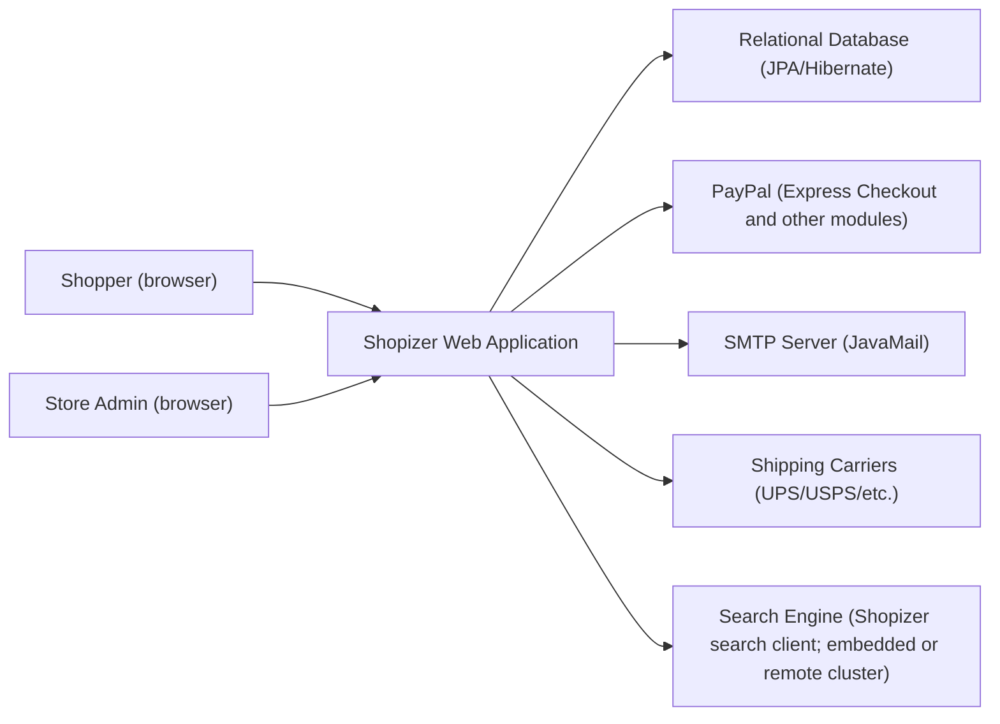
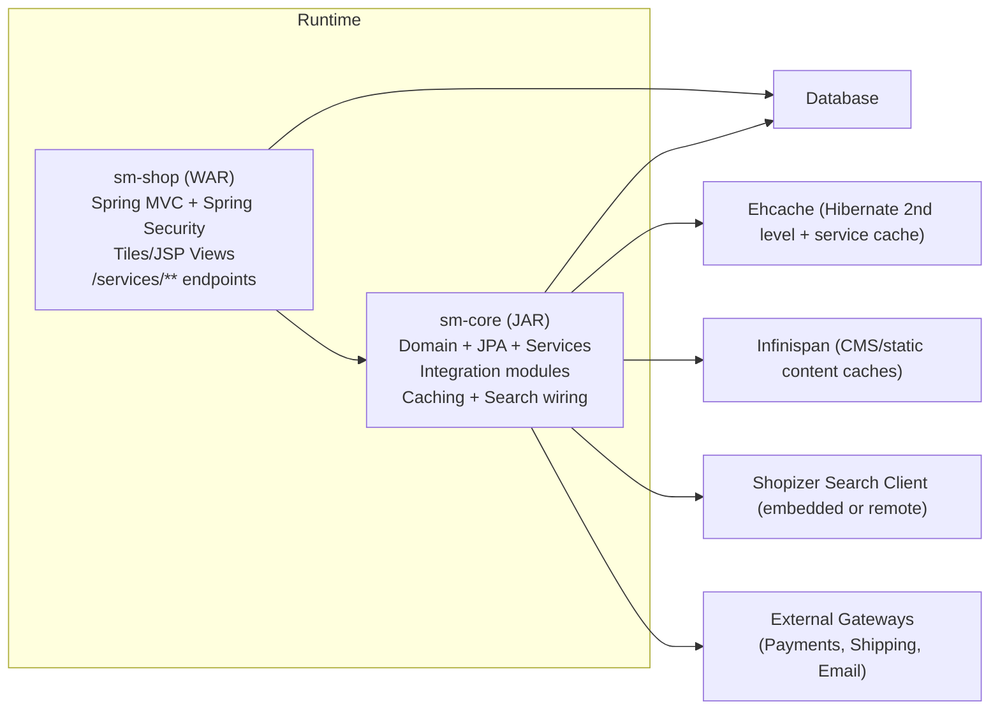
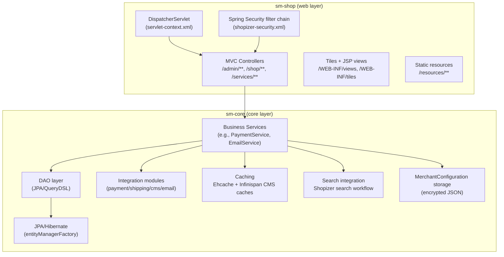
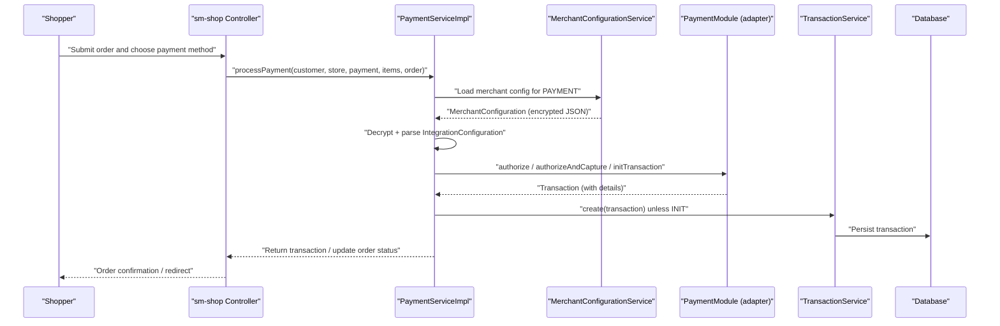
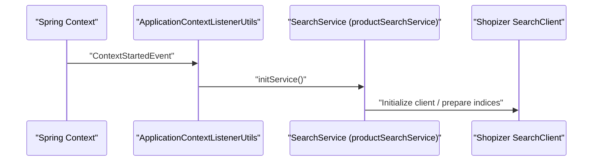
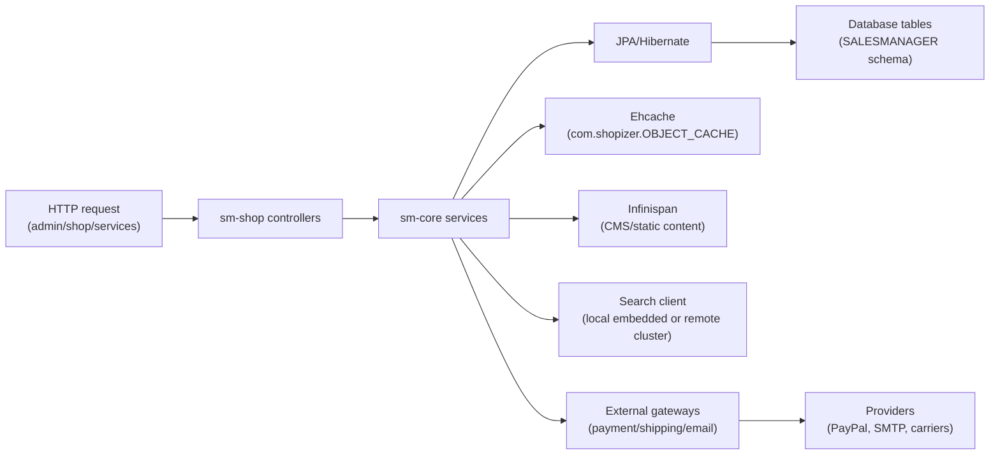
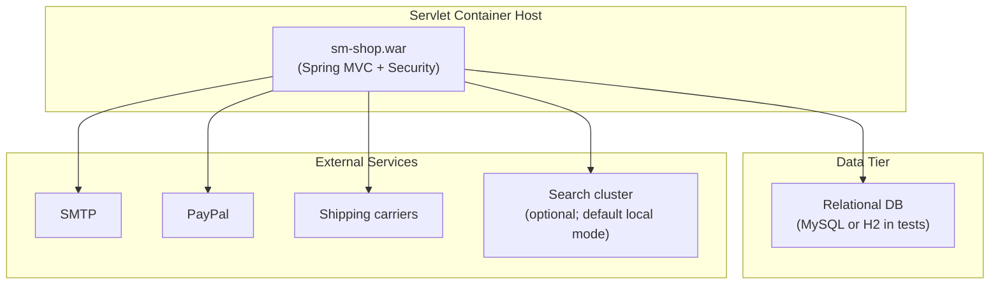

# Shopizer 2.x Legacy Architecture Overview

## 1. Purpose and Scope
This document describes the runtime architecture of the legacy Shopizer 2.x fork contained in the `shopizer/` workspace. It covers the primary runnable unit (`sm-shop` as a WAR deployed to a servlet container), its internal component boundaries, and key flows for browsing, checkout/payment, and search.

It does not attempt to fully enumerate every controller endpoint or every entity. Those details are split into the module, data model, and service layer documents.

## 2. Audience and Assumptions
This document is intended for engineers maintaining the legacy Shopizer fork, including those troubleshooting production behavior or planning incremental modernization. It assumes familiarity with Spring MVC, Spring Security, JPA/Hibernate, and servlet container deployment.

At runtime, the application assumes:
- A servlet container supporting Servlet 2.5 APIs (e.g., Tomcat 6-era deployment model), with Spring’s `DispatcherServlet`.
- A relational database available via JDBC (the provided test configuration uses H2 file mode; MySQL connector dependencies are present).
- Optional external services such as PayPal and a remote search cluster (although the default search configuration is “local” embedded mode).

## 3. System Context
Shopizer is a web storefront and admin console that serves web pages and REST-ish endpoints, backed by a database and multiple integration modules (payments, shipping, email) and a search subsystem.

### 3.1 Context Diagram (Mermaid)

This context view highlights that Shopizer is primarily HTTP-driven and persists business state in a relational database. External systems are invoked via module adapters, with module configuration stored per merchant.

## 4. Containers / Runtime Units
The legacy fork is organized into Maven modules, but the runtime is effectively a single web application:

- `sm-shop` is the deployable WAR. It hosts the Spring MVC controllers, Spring Security configuration, JSP/Tiles views, static resources, and façade/populator layers used to produce web DTOs.
- `sm-core` is a library JAR included by `sm-shop`. It hosts the domain model (JPA entities), the DAO and service layer, and integration module abstractions and implementations.

### 4.1 Container Diagram (Mermaid)

This diagram distinguishes the WAR (request-handling boundary) from the shared core business library, while acknowledging that they are tightly coupled in a single deployable unit.

## 5. Components (per Container)

### 5.1 Component Diagram(s) (Mermaid)

This component decomposition reflects the observed wiring: `web.xml` points at Spring contexts and the security filter chain, while `sm-core` provides most domain and service logic, including caching and search initialization.

## 6. Low-Level Design (LLD)
At a high level, the application follows a layered pattern.

The web layer (`sm-shop`) exposes:
- Admin pages and actions under `/admin/**` protected by `hasRole('AUTH')`.
- Storefront pages under `/shop/**` and customer actions protected by `hasRole('AUTH_CUSTOMER')`.
- Services under `/services/**` with stateless handling and a split between `/services/private/**` and `/services/public/**`.

The core layer (`sm-core`) provides:
- Entity persistence through `LocalContainerEntityManagerFactoryBean` configured in `spring-context.xml` and a persistence unit declared in `META-INF/sm-persistence.xml`.
- Transaction boundaries using `@tx:annotation-driven` and an AOP advisor that applies transaction advice to services implementing `TransactionalAspectAwareService`.
- A service cache backed by Ehcache (`com.shopizer.OBJECT_CACHE`) and additional CMS-related caches backed by Infinispan.

## 7. Key Flows (Sequence Diagrams)

### 7.1 Checkout and Payment (capture/refund capable)

This matches the observed behavior in `PaymentServiceImpl`, which loads merchant configuration, validates module configuration, delegates to a `PaymentModule` adapter, persists transactions, and updates order status.

### 7.2 Search Initialization and Query

The application uses an application context listener to ensure search is initialized on startup by calling `initService()` on the `productSearchService` bean.

## 8. Data Flow and Storage
Core business state is stored in a relational database via JPA. The persistence unit explicitly lists entity classes in `META-INF/sm-persistence.xml`, including `MerchantStore`, `Product`, `Order`, `Customer`, and several supporting entities for catalog, pricing, content, and user permissions.

Caching is used in multiple ways:
- Hibernate second-level caching is enabled via Ehcache provider configuration in `spring-context.xml`.
- A service cache (`com.shopizer.OBJECT_CACHE`) is exposed via Spring’s cache abstraction (`CacheUtils`).
- CMS/static content caching relies on Infinispan-backed tree caches for content storage and retrieval.

### 8.1 Dataflow Diagram (Mermaid)

## 9. Deployment / Execution Topology
The legacy deployment is a WAR (`sm-shop`) deployed to a servlet container. It links `sm-core` as a dependency. The deployment typically requires an RDBMS and may optionally require external gateway connectivity and search cluster access.

### 9.1 Deployment Diagram (Mermaid)

## 10. Interfaces and Integration Points
The externally visible interface is HTTP, implemented via Spring MVC with:
- A root `DispatcherServlet` mapped to `/` in `WEB-INF/web.xml`.
- Static resources exposed under `/resources/**`.
- Spring Security rules in `shopizer-security.xml` splitting admin, shop, and services access patterns.

Integration points are mediated through service and module abstractions. For example, payment configuration is stored per merchant in `MERCHANT_CONFIGURATION` under the key `PAYMENT` and is encrypted/decrypted in `PaymentServiceImpl`.

## 11. Cross-Cutting Concerns (NFRs)
Reliability is mostly derived from transactional database operations and defensive validation in service methods. There is no evidence in the reviewed sources of retry policies for external gateways, so failure behavior is primarily exception-based.

Performance relies on:
- Ehcache for frequently accessed objects and Hibernate second-level cache.
- Infinispan for static content/cms-related caching.
- Optional search indexing and search workflows that can run in embedded mode.

Security is handled via Spring Security with role-based URL interception and stateless `/services/**` behavior. Secrets and sensitive integration configuration may be stored as encrypted JSON in merchant configuration rows, but the cryptographic strength depends on the configured `secretKey`.

## 12. Design Decisions and Tradeoffs
Shopizer 2.x uses Spring XML contexts and Servlet 2.5-style WAR deployment, which simplifies deployment to standard servlet containers but makes configuration more centralized and less discoverable than annotation-first approaches.

Integration modules use a combination of:
- Database-backed module definitions (`IntegrationModule`) and
- Merchant-scoped configuration (`MerchantConfiguration`) storing JSON, encrypted for sensitive keys.

This enables per-merchant enabling/disabling of payment and shipping providers without redeploying code, but introduces complexity in configuration management.

## 13. Risks, Gaps, and Follow-ups
Information not available from current sources includes:
- A definitive list of shipping carrier adapters enabled by default and their exact configuration schema. The codebase contains shipping module packages, but this document would need additional reading of `shopizer-core-modules.xml` and the shipping module implementations to enumerate them precisely.
- Production database properties. Only a test database properties file was located; production deployment likely relies on environment-specific `database.properties` that is not present in the examined paths.

If deeper operational documentation is needed, the next files to inspect would typically include:
- `sm-core/src/main/resources/spring/shopizer-core-modules.xml` and any integration module JSON reference files under `sm-core/src/main/resources/reference/`.
- Any Docker, CI, or environment-specific properties files if present in the repository.
