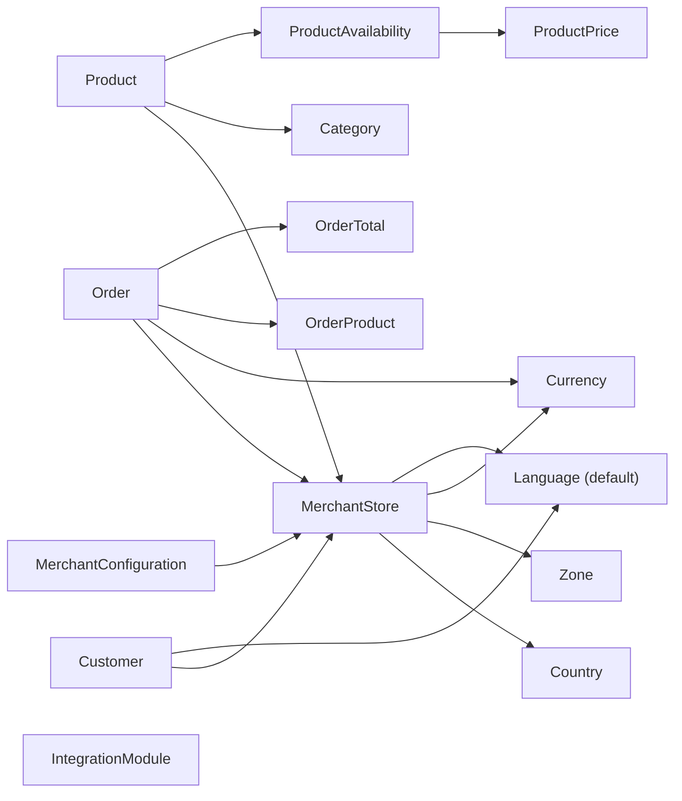

# Shopizer 2.x Legacy Data Model

## Overview
Shopizer persists its business state in a relational database using JPA/Hibernate. The persistence unit is declared in `sm-core/src/main/resources/META-INF/sm-persistence.xml` and lists the entity classes explicitly.

Most tables are mapped under the `SALESMANAGER` schema (as referenced by `SchemaConstant.SALESMANAGER_SCHEMA` in entity annotations). The exact schema creation scripts are not part of the reviewed sources in this documentation pass, but the JPA mappings define table names, key columns, and major relationships.

## Persistence Unit Definition
The persistence unit name is `sm-unit` and includes classes for:
- Merchant/store settings: `MerchantStore`
- Reference data: `Country`, `Zone`, `Language`, `Currency`, `GeoZone`
- System configuration and module configuration: `SystemConfiguration`, `IntegrationModule`, `MerchantConfiguration`, `SystemNotification`, `MerchantLog`
- Catalog: `Category`, `Product`, product descriptions, attributes, images, availability, pricing, manufacturers, relationships, reviews, types
- Orders: `Order`, `OrderProduct`, `OrderTotal`, `OrderStatusHistory`, and related classes
- Customer: `Customer` and customer attribute models
- Users/permissions: `User`, `Group`, `Permission`
- Shopping cart: `ShoppingCart` and line/attribute items

Evidence:
- `shopizer/sm-core/src/main/resources/META-INF/sm-persistence.xml`

## Core Entities and Relationships

### MerchantStore
`MerchantStore` is the primary tenant/store entity (`MERCHANT_STORE`), with:
- A unique store code (`STORE_CODE`) and store name.
- A required `Country` and optional `Zone`.
- A required default `Language` and a required set of supported languages (via a join table).
- A required `Currency`.

Evidence:
- `sm-core/src/main/java/com/salesmanager/core/business/merchant/model/MerchantStore.java`

The `useCache` flag indicates store-level caching preferences, but the cache implementation also depends on global Ehcache/Infinispan wiring.

### Product (Catalog)
`Product` maps to `PRODUCT` and includes:
- A required `MerchantStore` association (`MERCHANT_ID`).
- A many-to-many relation to `Category` via `PRODUCT_CATEGORY`.
- Collections for descriptions, availabilities, attributes, images, and relationships.

Evidence:
- `sm-core/src/main/java/com/salesmanager/core/business/catalog/product/model/Product.java`

The entity uses a table-based ID generator (`SM_SEQUENCER`) pattern common across Shopizer entities.

### ProductPrice (Pricing)
`ProductPrice` maps to `PRODUCT_PRICE` and is attached to a `ProductAvailability` (many-to-one). It includes:
- A price code (default `base`).
- A `productPriceAmount` and optional special price window.
- A set of localized `ProductPriceDescription` entries.

Evidence:
- `sm-core/src/main/java/com/salesmanager/core/business/catalog/product/model/price/ProductPrice.java`

### Customer
`Customer` maps to `CUSTOMER` and includes:
- Required email address and default language.
- Required `MerchantStore` association.
- Embedded `Delivery` and `Billing` address structures.
- Many-to-many membership in `Group` via `CUSTOMER_GROUP`.
- One-to-many `CustomerAttribute` values.

Evidence:
- `sm-core/src/main/java/com/salesmanager/core/business/customer/model/Customer.java`

The customer record is used by both the storefront and admin flows; authentication in the web module uses a dedicated `CustomerServicesImpl` for customer user details.

### Order
`Order` maps to `ORDERS` and includes:
- Order status (`OrderStatus` enum) and timestamps.
- A `customerId` field, rather than a foreign key association, which permits an order to exist even if a customer is deleted.
- A required association to `MerchantStore` via `MERCHANTID`.
- A set of `OrderProduct` line items, `OrderTotal` totals, and `OrderStatusHistory` history entries.
- Payment and shipping module codes (`PAYMENT_MODULE_CODE`, `SHIPPING_MODULE_CODE`) used to connect an order to an integration configuration at runtime.

Evidence:
- `sm-core/src/main/java/com/salesmanager/core/business/order/model/Order.java`

## Configuration and Integration Storage

### IntegrationModule (MODULE_CONFIGURATION)
`IntegrationModule` represents a configured module definition (such as a payment or shipping module) and stores:
- A module type/category (`MODULE`)
- A module code (`CODE`)
- Region applicability (`REGIONS`)
- Configuration and details fields stored as CLOBs

Evidence:
- `sm-core/src/main/java/com/salesmanager/core/business/system/model/IntegrationModule.java`

This entity is a global module definition rather than merchant-specific enablement.

### MerchantConfiguration (MERCHANT_CONFIGURATION)
`MerchantConfiguration` stores per-merchant configuration values. It enforces a uniqueness constraint on `(MERCHANT_ID, CONFIG_KEY)` and stores `VALUE` as a CLOB.

Evidence:
- `sm-core/src/main/java/com/salesmanager/core/business/system/model/MerchantConfiguration.java`

In the payment system, merchant configuration values often store encrypted JSON that is decrypted and parsed at runtime.

### IntegrationConfiguration (JSON model, not an entity)
`IntegrationConfiguration` is an in-memory JSON-aware model used to represent per-merchant integration settings, including:
- `moduleCode`
- `active`
- `defaultSelected`
- `environment` (e.g., `TEST` or `PRODUCTION`)
- `integrationKeys` and `integrationOptions`

Evidence:
- `sm-core/src/main/java/com/salesmanager/core/business/system/model/IntegrationConfiguration.java`

This object is commonly serialized into JSON and stored (encrypted) inside `MerchantConfiguration.value`.

## Relationship Summary (Conceptual)
The following diagram shows the major relationships at a conceptual level. It intentionally omits many secondary tables to remain readable.

## Notes and Gaps
Information not available from current sources includes:
- A definitive, generated DDL schema snapshot for production. The codebase includes a test helper (`ExportSchema`) elsewhere in tests, but a committed schema artifact was not part of the reviewed set.
- Full enumeration of all entity fields for every class listed in `sm-persistence.xml`. This document focuses on the entities most relevant for understanding core business flows.

For deeper schema exploration, the next step is typically to run the schema export test or locate any initialization SQL under `sm-core/src/test/resources/sql/`.
