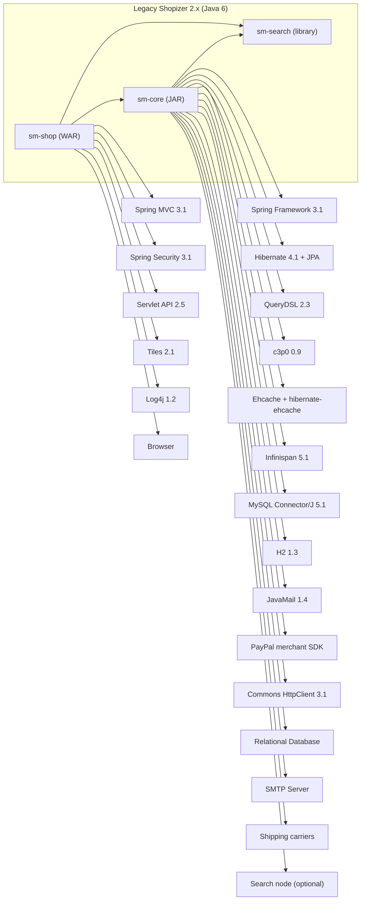

# Shopizer 2.x to Java 21 Migration Analysis

## Overview
This document summarizes migration-relevant findings from the Shopizer 2.x legacy codebase analysis and translates them into a modernization plan for the `shopizer-modern-java21` repository. It focuses on three outputs requested for this phase: a module criticality matrix, a dead-code and unused feature list, and a legacy dependency graph with Java-6-specific constraints.

This document is evidence-based on the legacy analysis already captured under `shopizer-modern-java21/docs/legacy-*.md` and on the legacy repository build/runtime artifacts (notably Maven POMs, `web.xml`, and the core Spring XML contexts). Where exact runtime usage cannot be proven from the currently reviewed sources, the document explicitly marks the item as needing verification.

## Module criticality matrix
The legacy fork is organized into two primary Maven modules, but behavior clusters into a set of business capabilities (catalog, cart, checkout, payments, shipping, customer, admin, etc.). The table below rates those capability areas along two dimensions.

Criticality definitions used in this matrix:
- Mission-critical: A break prevents purchasing or core store operations.
- High: A break degrades revenue-affecting flows or admin operations.
- Medium: A break impacts operations but has workarounds.
- Low: Optional capabilities or mostly cosmetic.
- Replaceable: Likely to be swapped for modern equivalents during modernization.

Change risk is based on coupling and complexity evidenced in the legacy architecture: XML wiring, Spring Security URL rules, JPA/Hibernate mapping breadth, and cross-cutting caches/search/integration modules.

| Capability / area | Primary legacy module(s) | Evidence (examples) | Criticality | Change risk | Notes for modernization sequencing |
|---|---|---|---|---|---|
| Storefront web UI + controllers | `sm-shop` (WAR) | Legacy runtime is `sm-shop.war` with Spring MVC, Tiles/JSP, URL patterns `/shop/**` | High | High | In a microservice target, the UI layer typically becomes separate (BFF + SPA). For phased migration, keep API contracts stable first. |
| Admin web UI + controllers | `sm-shop` (WAR) | `/admin/**` protected by Spring Security `hasRole('AUTH')` | High | High | Admin is operationally critical; consider isolating admin APIs early to avoid shared session/view coupling. |
| REST-ish services endpoints | `sm-shop` (WAR) | `/services/**` with `/services/private/**` protected and `/services/public/**` open | High | High | This layer is a natural seam for extraction into Spring Boot services; it also becomes the compatibility surface for clients. |
| Catalog (products, categories, manufacturers, attributes) | `sm-core` (JAR) | Entities like `Product`, `Category` in `sm-persistence.xml`; web populators for product DTOs | Mission-critical | High | Large data model; high read traffic. Candidate for early extraction with caching/search alignment. |
| Pricing (product price, availability, specials) | `sm-core` (JAR) | `ProductPrice` and related mappings | Mission-critical | High | Highly entangled with catalog and checkout totals. |
| Shopping cart | `sm-core` + `sm-shop` | Cart entities in persistence unit; web populators for cart DTOs | Mission-critical | High | Session coupling in legacy; migrate toward stateless cart API or explicit cart persistence. |
| Checkout + order placement | `sm-core` + `sm-shop` | Checkout described in legacy architecture sequences; order entities exist | Mission-critical | High | Hardest part due to orchestration and external payment/shipping integrations. |
| Orders (order lifecycle, invoices, history) | `sm-core` + `sm-shop` | `Order`, `OrderStatusHistory`; admin order actions controller exists in legacy repo | Mission-critical | High | Candidate for its own service boundary in target architecture. |
| Payments (module adapters, capture/refund) | `sm-core` | `PaymentServiceImpl`, `TransactionServiceImpl`, merchant encrypted JSON config | Mission-critical | High | Integration-heavy; plan for adapter pattern and secrets management redesign. |
| Shipping (carrier modules and custom rules) | `sm-core` + `sm-shop` | Shipping controllers exist; shipping modules indicated under `com.salesmanager.core.modules.integration.shipping` | High | High | Carrier integrations often benefit from isolation. Validate exact carrier implementations in `shopizer-core-modules.xml`. |
| Email (SMTP + templating) | `sm-core` | `EmailServiceImpl` uses merchant DB config; baseline `email.properties` | Medium | Medium | Often replaceable with modern provider integrations; keep adapter boundary. |
| Search (embedded/remote) | `sm-core` (+ `sm-search`) | `shopizer-search.xml`, `ApplicationContextListenerUtils` init | High | High | Legacy depends on an older Elasticsearch-era library (`org.elasticsearch` 0.90.x in properties). Plan a wholesale replacement (OpenSearch/Elasticsearch 8+). |
| Caching (Ehcache + Infinispan) | `sm-core` | Ehcache second-level cache and service cache; Infinispan CMS cache managers | Medium | High | Caching strategy should be redesigned (e.g., Redis + local caches). Don’t port 1:1 unless necessary. |
| CMS/static content (Infinispan tree caches) | `sm-core` + `sm-shop` | Infinispan CMS managers; JSP tags for page content exist in legacy repo | Medium | Medium | Likely replaceable or simplified; validate actual usage and content storage patterns. |
| Authentication/authorization | `sm-shop` | Spring Security 3.1 URL intercept rules, admin/customer roles | Mission-critical | High | Must be modernized for Spring Security 6; will impact session/auth models. |
| ReCAPTCHA | `sm-shop` | `recaptcha4j` dependency and keys in properties | Low | Low | Replace with modern reCAPTCHA libraries or alternative bot protection. |
| Reporting / document generation | `sm-core` | Dependencies like JasperReports, iText appear in core POM | Low to Medium | Medium | Verify whether used in admin flows; likely replaceable with modern PDF generation or external reporting. |

## Dead code and unused feature list
This section lists code and dependency areas that are likely dead, obsolete, or low-value to migrate, based on the reviewed sources. The intent is to shrink the modernization scope by avoiding porting features that are not central, are obsolete by technology constraints, or appear flagged by the legacy build itself.

Important: this list is “likely unused / de-prioritized” based on evidence in configuration and dependencies. A final decision requires runtime verification (production config, enabled modules, active endpoints).

### A. Marked “TO REMOVE” in build
The legacy `sm-core/pom.xml` includes a comment `<!-- TO REMOVE -->` on the Infinispan BDB JE cache store dependency. This suggests the repository itself considers it deprecable.

- `org.infinispan:infinispan-cachestore-bdbje:5.1.4.FINAL` is explicitly marked for removal in `sm-core/pom.xml`.

Migration implication: do not carry this store forward. Replace CMS/content caching with a simpler and supported mechanism.

### B. Legacy UI frameworks and bundled vendor assets
The legacy WAR includes large amounts of bundled JavaScript and UI assets (e.g., CKEditor plugins, SmartClient modules). These assets increase maintenance cost and are typically replaced during a modernization to a SPA or a modern UI stack.

Evidence:
- Numerous `sm-shop/src/main/webapp/resources/**` vendor scripts exist (CKEditor, SmartClient).

Migration implication: treat the entire JSP/Tiles + bundled JS asset stack as replaceable. Preserve backend APIs and domain behavior first.

### C. Servlet 2.5 WAR deployment model
The legacy is explicitly a Servlet 2.5 web application (`web-app` version `2.5`) and uses classic WAR deployment.

Evidence:
- `sm-shop/src/main/webapp/WEB-INF/web.xml` declares `version="2.5"` and `servlet-api 2.5` is a provided dependency in `sm-shop/pom.xml`.

Migration implication: do not attempt to “upgrade the WAR” directly; the target runtime should be Spring Boot 3.x executable services (Jakarta EE 9+), which is a breaking change.

### D. Legacy libraries and obsolete integration risk areas
These are dependencies that are typically not worth porting verbatim to Java 21 / Spring Boot 3.x due to age, security posture, or compatibility.

Evidence (from `sm-core/pom.xml` and `sm-shop/pom.xml`):
- Spring 3.1.x and Spring Security 3.1.x.
- Hibernate 4.1.x and `org.hibernate.cache.EhCacheProvider` usage.
- Log4j 1.2.16 runtime dependency in `sm-shop`.
- MySQL Connector/J 5.1.x and H2 1.3.x.
- `commons-httpclient:commons-httpclient:3.1` (very old HTTP client).
- `com.paypal.sdk:merchantsdk:2.6.109` (legacy SDK).
- `net.tanesha.recaptcha4j:recaptcha4j:0.0.7`.

Migration implication: plan to replace these with modern equivalents rather than “upgrade in place.”

### E. Search stack likely to be replaced
The legacy search wiring uses `sm-search` with a configuration that resembles an Elasticsearch-era embedded/remote client and references an old Elasticsearch version property.

Evidence:
- `sm-core/pom.xml` depends on `com.shopizer:sm-search`.
- `sm-core/pom.xml` properties include `<org.elasticsearch-version>0.90.2</org.elasticsearch-version>`.
- Legacy docs describe embedded “local” mode and remote mode via `clusterHost` and `clusterPort`.

Migration implication: treat search as a replacement project (new indexing model + new search service).

## Dependency graph with Java-6-specific constraints
### Legacy modules and runtime shape
The legacy is a “two-module build, single runtime” system:
- `sm-shop` is a WAR that is the only runtime artifact and hosts the HTTP endpoints and UI.
- `sm-core` is a JAR that holds entities, DAOs, services, and integration modules and is bundled into the WAR.

Evidence:
- `shopizer/sm-shop/pom.xml` packaging is `war` and depends on `com.shopizer:sm-core`.
- Legacy architecture overview documents the WAR/JAR split.

### Java 6 constraints and their consequences
Both modules compile for Java 6:
- `sm-core/pom.xml` sets `<jdk.version>1.6</jdk.version>` and compiler plugin uses it for `source` and `target`.
- `sm-shop/pom.xml` sets `<java-version>1.6</java-version>` and compiler plugin uses it.

Consequences for modernization planning:
- Language and API usage is constrained (no streams, no `java.time`, no modern TLS defaults).
- Dependency versions are pinned to pre-Jakarta namespaces (`javax.*`), which will not run on Spring Boot 3.x (Jakarta `jakarta.*`).
- Bytecode and reflection patterns in older libraries may fail under Java 21 without upgrades.

### Graph (Mermaid)
The following diagram focuses on “build-time + runtime dependencies” that shape the migration constraints. It intentionally omits internal package-level edges to remain readable.

### Java-6-specific constraints worth calling out explicitly
The constraints below are direct blockers or major cost drivers when moving to Java 21 and Spring Boot 3.x.

- Servlet/JSP era UI. The legacy uses a Servlet 2.5 WAR, Tiles, and JSP. Spring Boot 3.x no longer targets this stack as a primary model; a rewrite or significant re-platforming is expected.
- Spring Security namespace and API breakage. Spring Security 3.1 configuration patterns do not map directly to Spring Security 6.
- JPA and caching. Hibernate 4.1 and the Ehcache provider class (`org.hibernate.cache.EhCacheProvider`) are obsolete. Second-level cache config must be redesigned.
- “Search in embedded mode.” Embedded search that writes indices to the working directory is not aligned with containerized cloud deployments; target should run search as an external service.
- C3P0. This is legacy pooling; in Boot 3 the typical choice is HikariCP.
- Old logging. Log4j 1.x should not be migrated.

## Migration implications and recommended path
A pragmatic modernization approach is to preserve behavior while changing runtime shape in staged steps.

A reasonable sequencing, driven by criticality and risk, is:
1. Establish new APIs for catalog and customer read paths, using the existing data model as a baseline, but backed by PostgreSQL and modern JPA mappings.
2. Extract orders + checkout orchestration behind a stable API boundary.
3. Rebuild payments and shipping as adapter-driven services, ensuring capture/refund parity.
4. Replace search with a dedicated search service and new indexer pipeline.
5. Replace or reimplement admin and storefront UI, preferably as a separate frontend.

## Sources
This document was derived from:
- `shopizer-modern-java21/docs/legacy-architecture-overview.md`
- `shopizer-modern-java21/docs/legacy-module-package-map.md`
- `shopizer-modern-java21/docs/legacy-data-model.md`
- `shopizer-modern-java21/docs/legacy-service-controller-reference.md`
- `shopizer-modern-java21/docs/legacy-external-integrations.md`
- `shopizer/docs/build-deployment.md`
- `shopizer/sm-core/pom.xml`
- `shopizer/sm-shop/pom.xml`
- `shopizer/sm-core/src/main/resources/spring/spring-context.xml`
- `shopizer/sm-shop/src/main/webapp/WEB-INF/web.xml`
